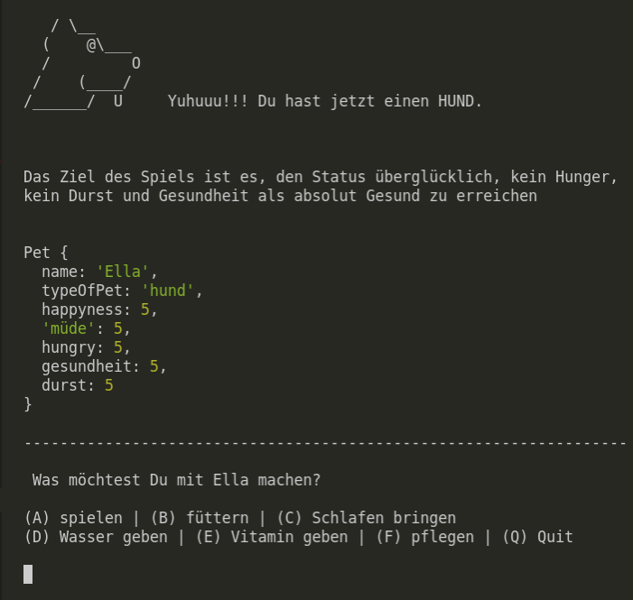

# Abschlussprojekt des DCI-Javascript-Moduls

## Haustierpflege: Die Mission!  
* Die Idee ist, ein interaktives Spiel zu entwickeln, das es dem Benutzer ermöglicht, direkt in Visual Studio Code über das Terminal zu spielen.
* Das Spiel ermöglicht es dem Spieler, das Spiel zu gewinnen oder zu verlieren, je nachdem, wie er spielt.
* Das Spiel hat keine feste Zeit, dh der Spieler kann weiterspielen, solange er nicht gewinnt oder verliert.
* Dies ist ein Projekt, das mit der Programmiersprache Javascript entwickelt wurde.  

  

## Technologien
* JavaScript
* Node.js
* Git
* Prompt-Sync (https://www.npmjs.com/package/prompt-sync)

## Anleitung
* [Click hier](Anleitung.md)

## Entwickler
* Entwickelt von Caroline Vargas, Mauro Stein und Siddik Polat.

